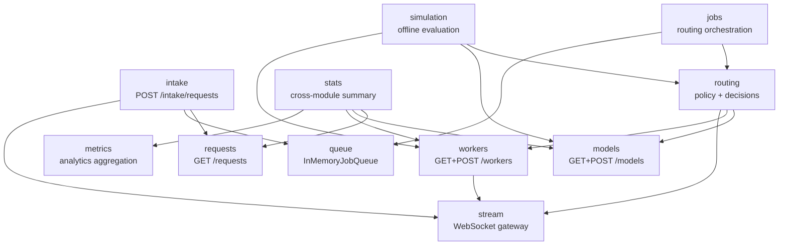
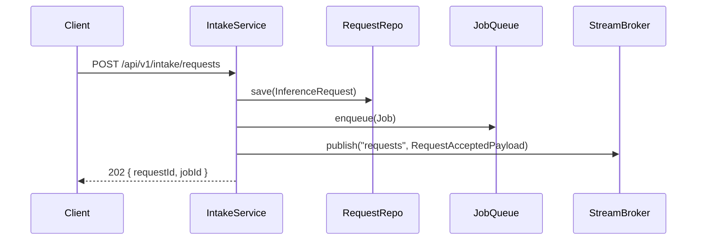
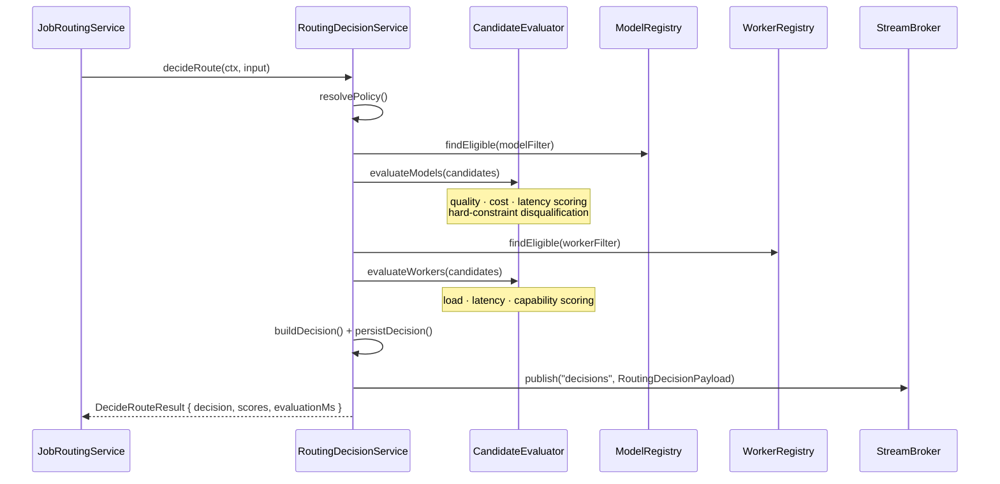
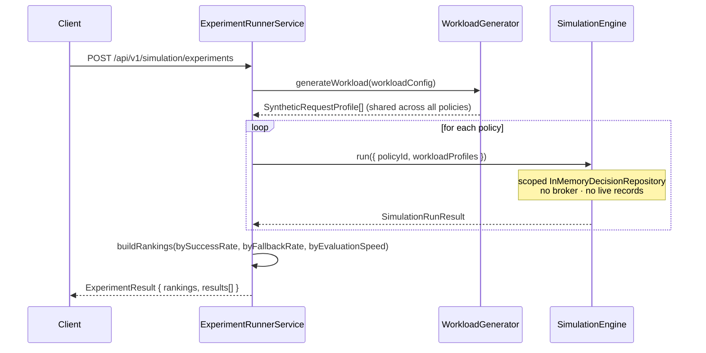
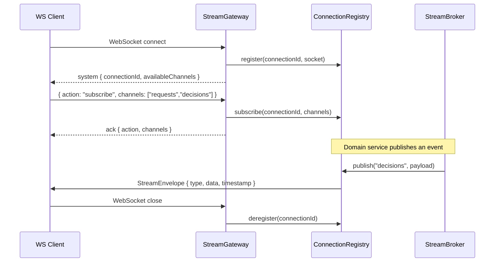

# Architecture

InferMesh is organized into bounded-context modules with a strict dependency hierarchy. Modules own their entities, repositories, services, and routes. All cross-module type sharing flows through `src/shared/contracts/` — no module imports from another module's internal files.

---

## Source layout

```
src/
├── main.ts                        Entry point: boot server, register shutdown hooks
├── app/
│   ├── server.ts                  Fastify factory (plugins, hooks, error handler)
│   └── routes.ts                  Central route registry — all module bindings here
│
├── core/                          Cross-cutting infrastructure
│   ├── config.ts                  Zod-validated env config; process.exit(1) on failure
│   ├── context.ts                 RequestContext Fastify decorator (requestId + logger)
│   ├── errors.ts                  ApiError class, global error handler, 404 handler
│   ├── logger.ts                  Standalone Pino logger for startup/background use
│   └── shutdown.ts                Graceful SIGINT/SIGTERM with drain timeout
│
├── shared/                        Domain language — pure contracts, no logic, no side-effects
│   ├── primitives.ts              Branded IDs, IsoTimestamp, PaginationQuery, BaseEntity
│   ├── types.ts                   ApiSuccessBody, ApiErrorBody, ResponseMeta
│   ├── response.ts                successResponse(), errorResponse(), buildMeta()
│   └── contracts/
│       ├── request.ts             InferenceRequest, RequestStatus, intake DTOs + Zod schemas
│       ├── job.ts                 Job, JobStatus, JobPriority, JobSourceType
│       ├── model.ts               Model, ModelProvider, ModelCapability, ModelTask, QualityTier
│       ├── worker.ts              Worker, WorkerStatus, WorkerHardware, WorkerRuntimeMetrics
│       ├── routing.ts             RoutingPolicy, RoutingDecision, RoutingStrategy, ScoreBreakdown
│       ├── metrics.ts             RequestMetricRecord, AggregatedMetrics, dashboard DTOs
│       ├── simulation.ts          SimulationConfig, SimulationResult
│       └── stream.ts              StreamEnvelope, StreamChannel, all channel payload shapes
│
├── infra/
│   ├── health/health.route.ts     GET /health — liveness probe (no downstream pings)
│   └── middleware/
│       ├── requestId.ts           x-request-id correlation header strategy
│       └── requestLogger.ts       Pino logger config + sensitive header redaction
│
├── stream/                        WebSocket pub/sub gateway
│   ├── contract.ts                Channel names, envelope types, all payload types
│   ├── broker/
│   │   ├── IStreamBroker.ts       publish(channel, payload) interface
│   │   └── stream-broker.ts       InMemoryStreamBroker: fan-out to subscribed connections
│   └── gateway/
│       ├── connection-registry.ts ConnectionRegistry: track WS connections and subscriptions
│       └── stream.gateway.ts      Fastify WebSocket plugin
│
└── modules/
    ├── requests/                  InferenceRequest lifecycle (CRUD, status transitions)
    ├── models/                    Model registry (CRUD, capability filtering, alias resolution)
    ├── workers/                   Worker registry (register, heartbeat, health eviction)
    ├── intake/                    Request acceptance: validate → persist → enqueue → publish
    ├── queue/                     InMemoryJobQueue + IJobQueue interface
    ├── jobs/                      Job lifecycle, routing orchestration, retry/recovery
    ├── routing/                   Policy resolution, candidate scoring, decision persistence
    ├── metrics/                   Request metric ingestion and aggregation
    ├── stats/                     Cross-module system stats API
    └── simulation/
        ├── service/               SimulationEngineService
        ├── workload/              WorkloadGeneratorService (synthetic request profiles)
        ├── experiment/            ExperimentRunnerService (multi-policy comparison)
        └── routes/                POST /simulation/runs, POST /simulation/experiments
```

---

## Dependency rules

```
modules/*     →  shared/contracts/   ✓  always allowed
modules/*     →  core/               ✓  config, errors, context
modules/*     →  stream/broker       ✓  via IStreamBroker interface injection only
modules/*     →  modules/*           ✗  never — shared contracts or injection only
stream/*      →  shared/contracts/   ✓
core/*        →  shared/             ✓
shared/*      →  (nothing internal)  pure-contract layer
```

Services are wired at each module's `index.ts` boundary using constructor injection. Tests use the same factory functions with in-memory repositories — no mocking framework required for most test cases.

---

## Module responsibilities

| Module | Owns | Key service |
|---|---|---|
| `requests` | InferenceRequest entities | `RequestsService` — CRUD, status projection |
| `models` | Model catalog, alias index | `ModelsService` → `ModelRegistryService` |
| `workers` | Worker registry, heartbeat eviction | `WorkersService` → `WorkerRegistryService` |
| `intake` | Request acceptance gate | `IntakeService` — validate, persist, enqueue, publish |
| `queue` | Job queue abstraction | `InMemoryJobQueue` implements `IJobQueue` |
| `jobs` | Job lifecycle, routing orchestration | `JobsService`, `JobRoutingService`, `RoutingRecoveryService` |
| `routing` | Policy CRUD, routing decisions, history | `RoutingService`, `RoutingDecisionService`, `CandidateEvaluatorService` |
| `metrics` | Request metrics, aggregation | `MetricsService` + `AnalyticsAggregationService` |
| `stats` | Cross-module summary | `StatsService` — composes data from other module services |
| `simulation` | Offline routing evaluation | `SimulationEngineService`, `WorkloadGeneratorService`, `ExperimentRunnerService` |
| `stream` | WebSocket pub/sub | `InMemoryStreamBroker`, `ConnectionRegistry`, `streamGateway` |

---

## Flows

### Intake / request acceptance

```
POST /api/v1/intake/requests
        │
        ▼
  IntakeService.intake()
    1. Validate body (Zod schema)
    2. Create InferenceRequest  →  InMemoryRequestRepository
    3. Create Job               →  InMemoryJobRepository
    4. Enqueue job              →  InMemoryJobQueue.enqueue()
    5. broker.publish("requests", RequestAcceptedPayload)   [best-effort]
    6. Return 202 { requestId, jobId }
```

---

### Routing decision

Triggered by `POST /api/v1/jobs/:id/route` or the internal job routing service:

```
RoutingDecisionService.decideRoute()
    1. resolvePolicy()
         → highest-priority Active policy, or named/UUID override
    2. modelRegistry.findEligible(modelFilter)
         → raw candidates from registry
    3. evaluator.evaluateModels(candidates, modelProfile, weights)
         → scored + ranked; hard constraints applied first
    4. select bestModel   — first eligible (score desc, id asc)
    5. workerRegistry.findEligible({ requiredModelId: bestModel, ...workerFilter })
    6. evaluator.evaluateWorkers(candidates, workerProfile, weights)
    7. select bestWorker  — same determinism
    8. buildDecision()    → RoutingDecision entity
    9. decisionRepo.save()
   10. evaluationStore.save(decisionId, modelScores, workerScores)  [history layer]
   11. broker.publish("decisions", RoutingDecisionPayload)  [best-effort]
   12. return DecideRouteResult { decision, modelScores, workerScores, evaluationMs }
```

**Scoring dimensions:**

| Dimension | Applied to | Signal |
|---|---|---|
| Quality | Model | Capability match, task fit, quality tier |
| Cost | Model | Cost-per-token |
| Latency | Model + Worker | Provider-reported latency + worker TTFT |
| Load | Worker | CPU%, memory%, queue depth → composite loadScore |

Hard-constraint disqualifications (missing capability, model not supported by worker, etc.) are recorded verbatim in the decision for the history API.

---

### Simulation

```
POST /api/v1/simulation/runs
        │
        ▼
  SimulationEngineService.run(input)
    1. Create run-scoped InMemoryDecisionRepository   (isolation — no live records)
    2. Wire RoutingDecisionService with scoped repo + NO broker
    3. For i in [0, requestCount):
         a. synthetic requestId  =  `${prefix}-${uuid}-${i}`
         b. workloadProfiles[i]  →  toModelProfile()  →  passed as modelProfile
         c. decideRoute()  — identical logic to live path
         d. record perModelSelections, perWorkerAssignments
         e. on error → errors[i]
    4. Aggregate successCount, failureCount, fallbackCount, averageEvaluationMs
    5. Return SimulationRunResult   (ephemeral — scoped repo is discarded)
```

**Isolation guarantees:** no `InferenceRequest` or `Job` created; decisions carry `DecisionSource.Simulation`; no stream events published; scoped repo discarded after run.

---

### Policy experiment

```
POST /api/v1/simulation/experiments
        │
        ▼
  ExperimentRunnerService.run(input)
    1. WorkloadGeneratorService.generateWorkload(workloadConfig)
         → SyntheticRequestProfile[]   (deterministic if randomSeed set)
    2. For each policyId in input.policies  (sequential, same profiles reference):
         SimulationEngineService.run({ policyId, workloadProfiles: profiles })
         → buildPolicyComparison()  or  buildZeroComparison() on unexpected throw
    3. buildRankings():
         bySuccessRate   (desc)
         byFallbackRate  (asc)
         byEvaluationSpeed (asc)
    4. Return ExperimentResult { experimentId, results[], rankings, durationMs }
```

Workload generation happens **once**. All policies see the same request profiles, making comparisons directly meaningful.

---

### WebSocket stream

```
Client:  ws://host/api/v1/stream

Connect:
  ConnectionRegistry.register(id, socket)
  → Server sends system frame: { type:"system", data:{ connectionId, availableChannels } }

Subscribe:
  Client sends: { "action": "subscribe", "channels": ["requests","decisions"] }
  → ConnectionRegistry.subscribe(id, channels)
  → Server sends ack frame: { type:"ack", data:{ action, channels } }

Events published by domain services:
  IntakeService              →  broker.publish("requests",  RequestAcceptedPayload)
  WorkersService             →  broker.publish("workers",   WorkerStatusPayload)
  RoutingDecisionService     →  broker.publish("decisions", RoutingDecisionPayload)
  JobRoutingService          →  broker.publish("routing",   RoutingOutcomeSummaryPayload)

InMemoryStreamBroker.publish(channel, payload):
  Wrap in StreamEnvelope { type, data, timestamp }
  For each connection subscribed to channel → socket.send(JSON)
  Errors are caught and logged at warn — never abort the caller

Disconnect:
  ConnectionRegistry.deregister(id)  — subscriptions cleaned up
```

---

## API response envelope

```jsonc
// Success
{ "success": true, "data": { ... }, "meta": { "requestId": "uuid", "timestamp": "iso" } }

// Error
{ "success": false, "error": { "code": "NO_ACTIVE_POLICY", "message": "..." }, "meta": { ... } }
```

Standard error codes: `NOT_FOUND` (404), `VALIDATION_ERROR` (400), `NO_ACTIVE_POLICY` (503), `NO_ELIGIBLE_MODEL` (422), `NO_ELIGIBLE_WORKER` (422), `INTERNAL_SERVER_ERROR` (500).

---

## Request correlation

Every request carries a `requestId` (UUID v4) sourced from the inbound `x-request-id` header or generated server-side. The ID is attached to every Pino log line for that request via `RequestContext`, echoed as a response header, and stored on `InferenceRequest`, `Job`, and `RoutingDecision` entities for end-to-end tracing.

---

## Frontend dashboard

A React + TypeScript admin console lives at [`frontend/`](../frontend/). It connects to this backend over REST and WebSocket and provides live stream panels, a filterable request log, worker health cards, analytics charts, and an interactive offline simulation console.

See [frontend/README.md](../frontend/README.md) for setup, architecture, and the recommended demo walkthrough.

---

## Architecture diagrams

Mermaid renderings of the key flows. These supplement the text descriptions above.

### Module dependency graph



### Request intake flow



### Routing decision flow



### Policy experiment flow



### WebSocket stream flow


